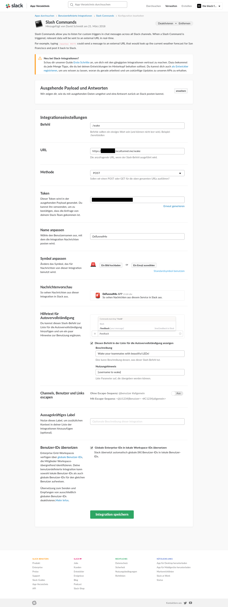
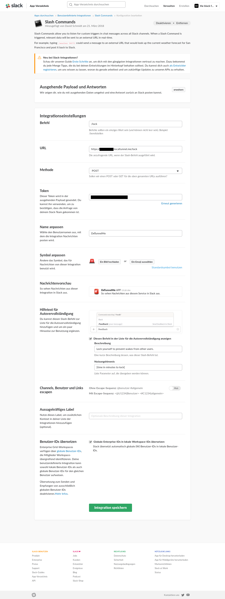

# How to setup the server

## Raspberry Pi

For setting up a headless Raspberry Pi 3 using Wifi, I reccommend this tutorial: [https://caffinc.github.io/2016/12/raspberry-pi-3-headless/](https://caffinc.github.io/2016/12/raspberry-pi-3-headless/)

But forget the stuff about networking in the end. If your /etc/wpa_supplicant/wpa_supplicant.conf looks like this one, it should work:

```
ctrl_interface=DIR=/var/run/wpa_supplicant GROUP=netdev
update_config=1
network={
    ssid="yourSSIDhere"
    psk="yourPasswordHere"
    key_mgmt=WPA-PSK
}
```

After that, ssh into your Pi and copy the whole DeTunnelMe-project to the /home/pi

You should get a similar result:

```bash
pi@raspberrypi:~ $ tree -d /home/pi/DeTunnelMe/ -I "node_modules|libraries"
/home/pi/DeTunnelMe/
├── Arduino
│   ├── DeTunnelMe
│   ├── DeTunnelMe_Client
│   └── DeTunnelMe_Server
├── docs
└── views
```

```bash
pi@raspberrypi:~ $ ls /home/pi/DeTunnelMe/
Arduino             detunnelme_slack.service  index.html  localtunnel_slack.service  slack.js
detunnelme.service  docs                      index.js    node_modules               views
```

Also (whyever) the nodejs executable is called "nodejs" when installed via apt-get, but npm sometimes expects it to be "node", so run:

`sudo ln -s /usr/bin/nodejs /usr/bin/node`

Enable I2C: [https://learn.adafruit.com/adafruits-raspberry-pi-lesson-4-gpio-setup/configuring-i2c](https://learn.adafruit.com/adafruits-raspberry-pi-lesson-4-gpio-setup/configuring-i2c)

Install localtunnel to make your server accessible for the slack command:

```bash
npm install -g localtunnel
```

Run 

```bash
node index.js
node slack.js
```

and install the needed modules. These modules should be (but there are possibly some missing):

`npm install fs net http express passport passport-local i2c cookie-parser body-parser express-session events request`

The domain under which your server will be accessible for the slack command is defined in `localtunnel_slack.service` - so copy `localtunnel_slack.service.template` to `localtunnel_slack.service` and change it, if you want (or if you get strange errors). It is this line:

`ExecStart=/usr/local/bin/lt --port 8081 --subdomain yourcooldomainname`

If you run the command manually, you should get something like this:

`your url is: https://yourcooldomainname.localtunnel.me/`

Remember this url for adding a slack-command later!

Copy all .service files in your DeTunnelMe-directory to /etc/systemd/system/

`sudo cp -v *.service /etc/systemd/system/`

To run your server at boot, enable all services:

```bash
sudo systemctl enable localtunnel_slack
sudo systemctl enable detunnelme
sudo systemctl enable detunnelme_slack
```

and reboot. 

## Arduino Uno

Select the `DeTunnelMe_Server.ino` sketch and upload it to your Arduino as described in 

[How to program an Arduino](./How-to-program-an-Arduino.md)

## Adding the slack command

Go to [https://my.slack.com/services/new/slash-commands](https://my.slack.com/services/new/slash-commands) if you want to add a new command (the procedure is more or less well-described here: [https://girliemac.com/blog/2016/10/24/slack-command-bot-nodejs/](https://girliemac.com/blog/2016/10/24/slack-command-bot-nodejs/) and don't laugh about the site titel ;)

or go to [https://my.slack.com/apps/manage/custom-integrations](https://my.slack.com/apps/manage/custom-integrations) to manage your existing commands. The configuration for /wake and /lock looks like the following:





The URL depends on your setting in `localtunnel_slack.service` and the Token is automatically generated. Now you need to insert these tokens into your `slackToken.js` - if you don't have one yet, copy the .template-file:

```javascript
module.exports = {
    tokenWake: "yourLongTokenblablabla",//Slack command token for wake command
    tokenLock: "yourDifferentLongToken"//Slack command token for lock command
};
```

This makes sure that POST-requests reaching our Node.js server really come from Slack.

*And... that's it - I think :D*