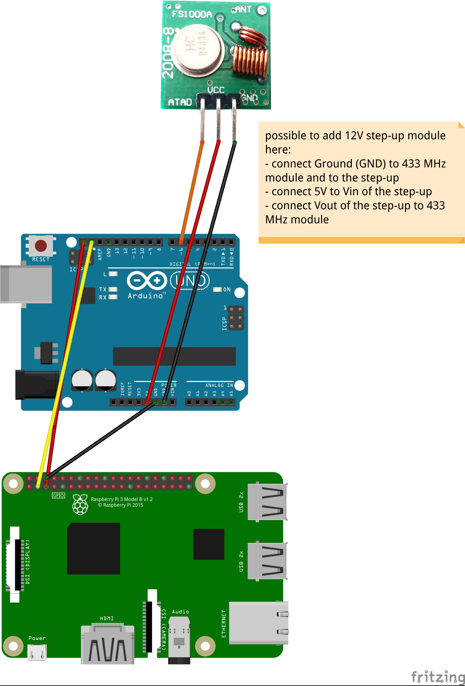
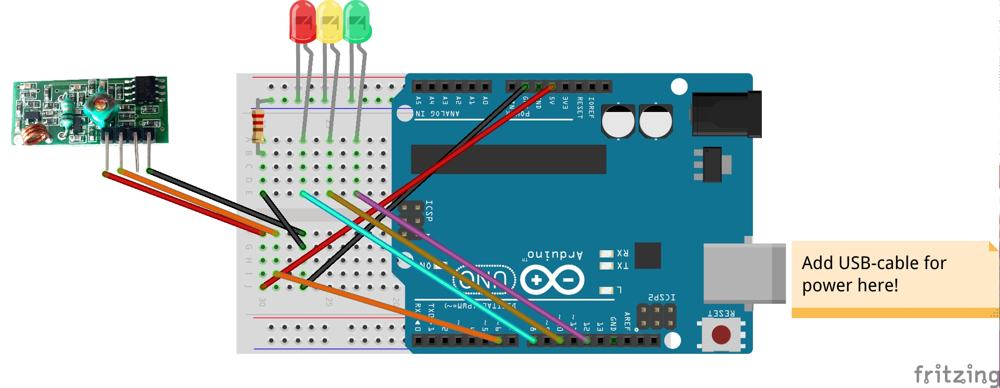

# How to wire

There are two parts you need to build to get a running DeTunnelMe system.

A server serving the webpage and sending commands to the clients via 433MHz modules, consisting of:
1. A Raspberry Pi (tested with version 3, but the only real condition is that it supports I2C via jumper wires)
    1. MicroSD-card, 16GB is good
    2. Micro USB power adapter (there are several adapers with "Raspberry Pi 3 support", but any adapter with at least 2500mA should work)
2. An Arduino (tested with [Uno-clones](https://www.amazon.de/Elegoo-Entwicklungsplatine-ATmega328P-ATmega16U2-USB-Kabel/dp/B01EWOE0UU/ref=sr_1_2?ie=UTF8&qid=1521722867&sr=8-2&keywords=elegoo+uno), but every other Arduino-supporting board will do the job, as long as it supports I2C)
3. A [433MHz transmitter](https://www.amazon.de/gp/product/B071J2Z3YK/ref=ox_sc_act_title_1?smid=A2XXYTY5NMDPP3&psc=1)
4. [Jumper wires](https://www.amazon.de/Elegoo-Female-Female-Male-Female-Steckbr%C3%BCcken-Drahtbr%C3%BCcken-bunt/dp/B01EV70C78/ref=sr_1_3?s=ce-de&ie=UTF8&qid=1521723811&sr=1-3&keywords=jumper) (male-male, male-female, female-female - all possibly needed here)
5. (A [step-up converter](https://www.exp-tech.de/module/stromspannung/4829/pololu-12v-step-up-spannungsregler-u3v12f12) to run the transmitter with 12V to extend the range)  

As many clients as you need, consisting of:
1. An Arduino [Uno](https://www.amazon.de/Elegoo-Entwicklungsplatine-ATmega328P-ATmega16U2-USB-Kabel/dp/B01EWOE0UU/ref=sr_1_2?ie=UTF8&qid=1521722867&sr=8-2&keywords=elegoo+uno) [(]()[clone](https://www.amazon.de/Elegoo-Entwicklungsplatine-ATmega328P-ATmega16U2-USB-Kabel/dp/B01EWOE0UU/ref=sr_1_2?ie=UTF8&qid=1521722867&sr=8-2&keywords=elegoo+uno))
2. A [breadboard](https://www.amazon.de/Elegoo-Breadboard-Stromschienen-Arduino-Jumper/dp/B01M5CUL7Z/ref=sr_1_cc_2?s=aps&ie=UTF8&qid=1521723751&sr=1-2-catcorr&keywords=breadboard+elegoo) (well, you could solder it, too - but then all these parts are not really reusable...)
3. [Jumper wires](https://www.amazon.de/gp/product/B00IRYUZMO/ref=ox_sc_act_title_1?smid=A1UCWJGSNE58E4&psc=1) (just male-male wires here)
4. [A resistor](https://www.amazon.de/Elegoo-Widerst%C3%A4nde-Sortiment-St%C3%BCck-Metallfilm/dp/B072BHDBDG/ref=sr_1_2?s=ce-de&ie=UTF8&qid=1521723980&sr=1-2&keywords=widerst%C3%A4nde) with (at least) 220 Ohm (180 Ohm seem to work, too - you can play around with it, you should have enough LEDs ;)
5. A [433MHz receiver](https://www.amazon.de/gp/product/B071J2Z3YK/ref=ox_sc_act_title_1?smid=A2XXYTY5NMDPP3&psc=1)

## Circuit diagrams

Server

Client

